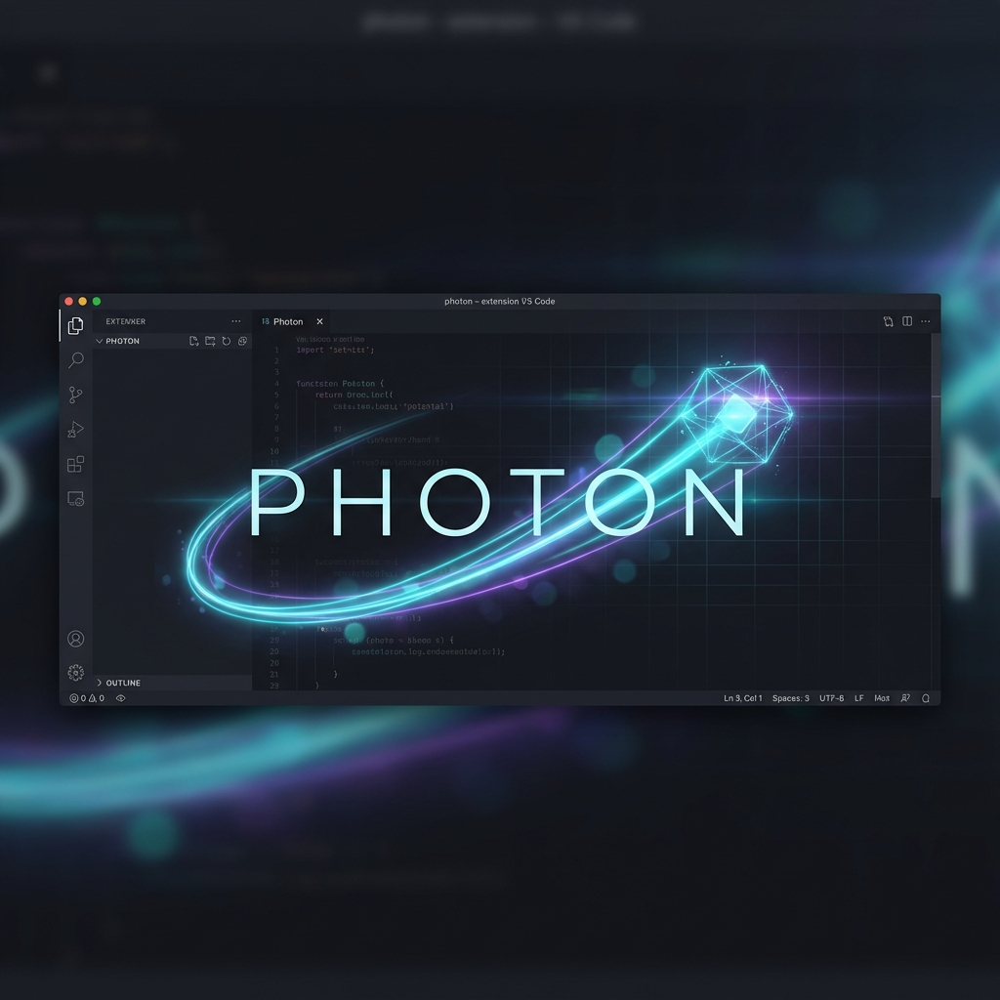

# Photon

<p align="center">
  
</p>

A minimalist REST client for VS Code that stays out of your way. Built for developers who want a fast, dark-mode-first environment to test APIs.

There are plenty of REST clients for VS Code. Photon is built for speed and aesthetics:

- **Fast**: No bloat, no complex config. Open and send.
- **OLED UI**: Pure black theme with high-contrast syntax highlighting.
- **Interoperable**: Save your requests locally or move them to/from Postman.

## Features

- **Saved Requests**: Persistent local storage for your 200 OKs.
- **JSON Tree**: Collapsible, syntax-highlighted response viewer.
- **Import/Export**: Supports Postman Collection v2.1 format.
- **History**: Automatic tracking of your latest requests.
- **Auth**: Bearer and Basic authentication support.
- **Response Meta**: Check status, time, and line count at a glance.

## Installation

- **Marketplace**: Search for `Photon` in VS Code Extensions.
- **Manual**: Download the `.vsix` file from the [latest release](https://github.com/sebavidal10/photon-rest-client/releases), then in VS Code run: `Extensions: Install from VSIX...`

## Usage

1. Open the Command Palette (`Cmd/Ctrl + Shift + P`).
2. Type `Open Photon`.
3. Set your method/URL and go.

## Development

If you want to run it locally:

```bash
npm install
npm run watch
```

Then press `F5` to launch the extension.

## License

MIT
