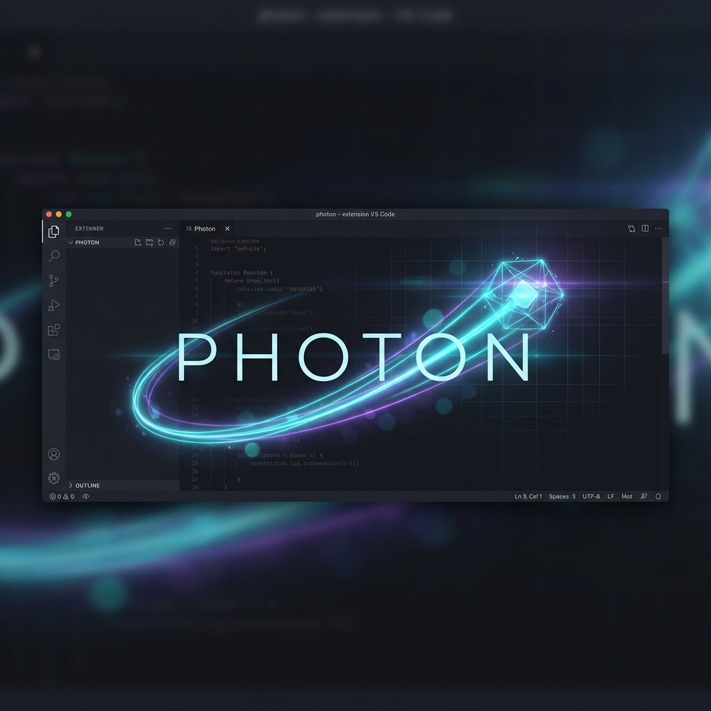

# Photon

<p align="center">
  
</p>

A minimalist, high-performance REST client for VS Code that stays out of your way. Built for developers who want a fast, dark-mode-first environment to craft, test, and organize APIs in parallel.

## Features

- **Multi-Tab Parallel Workspaces**: Work with multiple API requests in parallel with isolated state, method badges, smooth mouse-wheel tab scrolling, and auto-focusing tabs.
- **Collections & Folders**: Organize requests into named collections (e.g., Auth, Users, Payments) with collapsible accordion folders and sidebar hierarchy.
- **Drag & Drop Reordering**: Freely reorder endpoints and drag requests between collections with instant persistence.
- **Full Request & Folder Editing**: Edit endpoint name, URL, headers JSON, formatted body JSON, and auth credentials, or rename entire collections on the fly.
- **Full Postman Interoperability**: Import and export Postman collections (v2.0 & v2.1) preserving nested folders, URLs, headers, bodies, and Bearer / Basic authentication.
- **Resizable Split Layout**: Easily drag the divider between request configuration and the response viewport with clean, clutter-free borders.
- **Adaptive Full-Height Views**: "Saved" and "History" tabs expand to full available height for managing endpoints comfortably.
- **Delete Confirmation Safeguards**: Modal confirmations prevent accidental deletion of requests, folders, or history.
- **URL Validation**: Validates endpoint URLs before saving to ensure clean collection data.
- **Interactive JSON Tree**: Collapsible, syntax-highlighted response viewer with instant Pretty / Raw switching.
- **Authentication**: Native support for Bearer Token and Basic Auth across requests and imports.
- **Sidebar Launcher & Explorer**: One-click activity bar launcher and sidebar tree view to browse saved requests.
- **History Tracking**: Automatic tracking of request history with quick-restore capabilities.

## Installation

### From Marketplace

Search for `Photon REST Client` in the VS Code / Antigravity Extensions view (`Cmd+Shift+X` or `Ctrl+Shift+X`).

### Manual Installation (.vsix)

1. Go to the [Releases](https://github.com/sebavidal10/photon-rest-client/releases) page.
2. Download `photon-rest-client-0.2.0.vsix`.
3. In VS Code, open the **Extensions** view (`Cmd+Shift+X` or `Ctrl+Shift+X`).
4. Click `...` (Views and More Actions) in the top right corner.
5. Select **Install from VSIX...** and choose the downloaded file.

## Usage

1. Open the Command Palette (`Cmd/Ctrl + Shift + P`) and type **Open Photon**.
2. Or click the **Photon** icon in your **Activity Bar** (sidebar).
3. Use the `+` button on the top tab bar to open multiple request tabs in parallel.

## Development & Packaging

```bash
# Install dependencies
npm install

# Run watch mode for development
npm run watch

# Package production VSIX
npm run package
npx @vscode/vsce package
```

## License

[MIT](LICENSE) © Sebastian Vidal
